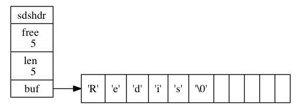

近来对着文档学习一波Redis的设计与实现，一边看一边记笔记。

1. **SDS的定义**
>SDS对应的结构体sds.h/sdshdr
>```C++
>struct sdshdr{
>	//记录buf数组已存入的字节数
>	//sds结构体存入的字符串的长度
>	int len;
>	//当前sds结构体未使用的字节数(可调整)
>	int free;
>	char buf[];
>};
>```
>
下图为SDS一个示例


>
>**free**的属性值为0，表示当前SDS还有5个可用**字节**
>**len**的属性值为5，表示当前SDS存入的字符串长度是5个**字节**
>**buf**是个字符数组，前len个字节保存存入的字符，最后一个字节默认一直是保存空字符**'\0'**
>SDS默认保存多一个空字符，这样就能沿用C的部分字符串语法，而SDS仅仅是多用了一个字节的空间

2. **字符串长度时间复杂度**

   <!--more-->
>很显然，SDS结构获取存入字符长度的时间复杂度是O(1)，但是C的字符串是通过遍历字符串，直至遇到空字符才停止，因此C字符串的时间复杂度是O(n)，这样就保证获取字符串长度不会成为性能瓶颈。

3. **杜绝缓冲区溢出**
>C字符串还有一个问题是很容易造成内存缓冲区溢出。
常见的示例:
```C++
//string.h/strcat
//将src字符串的内容拼接到dest字符串末尾
char * strcat(char *dest, const char *src);
```
>当用户忘记给dest分配足够的内存时，拼接src的时候就会出现内存缓冲区溢出，就会出现不可预知的问题。
SDS则完全避免了这个问题，`sdscat`在进行拼接之前会先判断拼接的字符串长度是否大于SDS的`free`，如果大于，就会先扩展空间，再进行拼接，这样就杜绝了内存缓冲区溢出的问题，但这样就可能导致SDS频繁扩展空间，这个由SDS的内存分配策略解决，往下看。

4. **内存重分配策略**
>**C字符串**
>- 增长字符串(append)，如果忘记内存扩展就有可能导致内存缓冲区溢出。
>- 缩短字符串(trim)，如果忘记释放对应缩短的空间就有可能导致内存泄漏。
>当多次对一个字符串进行增长、缩短操作时，会发现会有多次重复的内存重分配，而内存重分配涉及到系统调用，比较耗时，这样就浪费了很多时间。而Redis被作为进行频繁数据交互的数据库，这种情况会经常出现。
>
>**SDS策略(空间预分配)**
>- 增长字符串(sdscat)，当发现需要空间扩展的时候，程序不仅会给SDS分配所需要的空间，还会分配额外的未使用空间。
>- 缩短字符串(sdstrim)，当空间减少时，程序不会去回收这部分空间，而是保留在未使用空间中，等待后续使用。
>
>**多分配空间的原则**
>- 当修改完之后SDS空间长度小于`1MB`时，程序会分配与SDS相同长度的额外空间，即SDS总空间 = SDS字符串长度 * 2 + 1字节。
>- 当修改完之后长度大于`1MB`时，程序只会额外分配`1MB`的额外空间，即SDS总空间 = SDS字符串长度 + 1M + 1字节。
>（PS:看文档这里似乎没有提到SDS的回收策略，后续看到再补充。）

5. **二进制安全**
>C字符串的字符必须符合某种编码（如ASCII），并且除了字符串的末尾之外，字符串里面不能包含空字符，否则程序读取的时候会被截断。从而使字符串无法保存一些图片音频等二进制数据。
>
>为了确保Redis适用于各种场景，SDS的API都是二进制安全的（binary-safe）：所有 SDS API 都会以处理二进制的方式来处理SDS存放在buf数组里的数据， 程序不会对其中的数据做任何限制、过滤、或者假设 —— 数据在写入时是什么样的， 它被读取时就是什么样。
SDS的buf属性用来保存一系列的二进制数据，而不是用来保存字符。虽然是用来保存二进制数据，但是遵循C字符串的规则，保存数据的末尾加一个空字符，使SDS可以重用一部分`string.h`库的一些函数。

6. **总结**
<table><tr><td>C 字符串</td><td>SDS</td></tr><tr><td>获取字符串长度的复杂度为 O(N) 。</td><td>获取字符串长度的复杂度为 O(1) 。</td></tr><tr><td>API 是不安全的，可能会造成缓冲区溢出。</td><td>API 是安全的，不会造成缓冲区溢出。</td></tr><tr><td>修改字符串长度 N 次必然需要执行 N 次内存重分配。</td><td>修改字符串长度 N 次最多需要执行 N 次内存重分配。</td></tr><tr><td>只能保存文本数据。</td><td>可以保存文本或者二进制数据。</td></tr><tr><td>可以使用所有 <string.h> 库中的函数。</td><td>可以使用一部分 <string.h> 库中的函数。</td></tr></table>

7. **SDS主要操作的API**

<table><tr><td>函数</td><td>作用</td><td>时间复杂度</td></tr><tr><td>sdsnew</td><td>创建一个包含给定 C 字符串的 SDS 。</td><td>O(N) ， N 为给定 C 字符串的长度。</td></tr><tr><td>sdsempty</td><td>创建一个不包含任何内容的空 SDS 。</td><td>O(1)</td></tr><tr><td>sdsfree</td><td>释放给定的 SDS 。</td><td>O(1)</td></tr><tr><td>sdslen</td><td>返回 SDS 的已使用空间字节数。</td><td>这个值可以通过读取 SDS 的 len 属性来直接获得， 复杂度为 O(1) 。</td></tr><tr><td>sdsavail</td><td>返回 SDS 的未使用空间字节数。</td><td>这个值可以通过读取 SDS 的 free 属性来直接获得， 复杂度为 O(1) 。</td></tr><tr><td>sdsdup</td><td>创建一个给定 SDS 的副本（copy）。</td><td>O(N) ， N 为给定 SDS 的长度。</td></tr><tr><td>sdsclear</td><td>清空 SDS 保存的字符串内容。</td><td>因为惰性空间释放策略，复杂度为 O(1) 。</td></tr><tr><td>sdscat</td><td>将给定 C 字符串拼接到 SDS 字符串的末尾。</td><td>O(N) ， N 为被拼接 C 字符串的长度。</td></tr><tr><td>sdscatsds</td><td>将给定 SDS 字符串拼接到另一个 SDS 字符串的末尾。</td><td>O(N) ， N 为被拼接 SDS 字符串的长度。</td></tr><tr><td>sdscpy</td><td>将给定的 C 字符串复制到 SDS 里面， 覆盖 SDS 原有的字符串。</td><td>O(N) ， N 为被复制 C 字符串的长度。</td></tr><tr><td>sdsgrowzero</td><td>用空字符将 SDS 扩展至给定长度。</td><td>O(N) ， N 为扩展新增的字节数。</td></tr><tr><td>sdsrange</td><td>保留 SDS 给定区间内的数据， 不在区间内的数据会被覆盖或清除。</td><td>O(N) ， N 为被保留数据的字节数。</td></tr><tr><td>sdstrim</td><td>接受一个 SDS 和一个 C 字符串作为参数， 从 SDS 左右两端分别移除所有在 C 字符串中出现过的字符。</td><td>O(M*N) ， M 为 SDS 的长度， N 为给定 C 字符串的长度。</td></tr><tr><td>sdscmp</td><td>对比两个 SDS 字符串是否相同。</td><td>O(N) ， N 为两个 SDS 中较短的那个 SDS 的长度。</td></tr></table>

8. **优点**

与C字符串相比,SDS具有以下优点：
>1. 常数复杂度获取字符串长度。
>2. 杜绝缓冲区溢出。
>3. 减少修改字符串长度时的内存重分配次数。
>4. 二进制安全。
>5. 兼容部分C字符串函数。